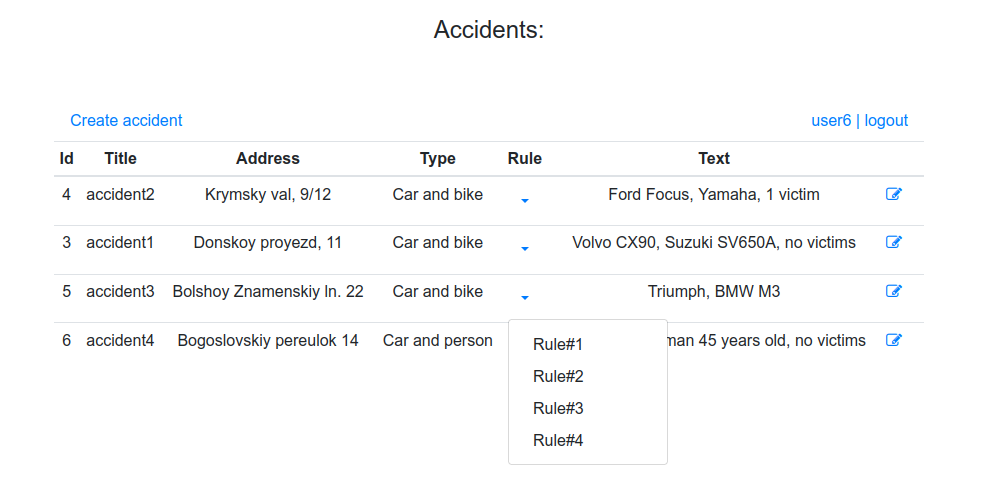
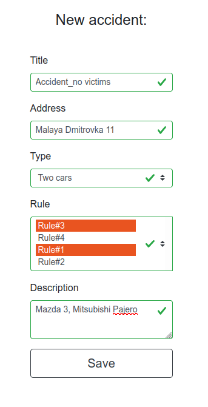
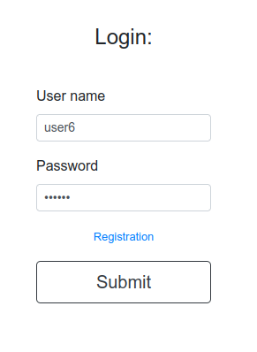

# Car accident
[](https://travis-ci.com/amasterenko/job4j_car_accident)    

____ 
### Used technologies  
* Java Servlets/JSTL  
* Spring (Web, JDBC, ORM, Data, Security)  
* Hibernate
* PostgreSQL
* Maven
* Travis CI 


### Features
- User's authentication  
- Creating/updating accidents  

### User interface  
  
  
  

### Configuration
Create a PostgreSQL database with the name _auto_crash_ and set the DB credentials to _./resources/app.properties_.  
The default ones are :
```
jdbc.url=jdbc:postgresql://127.0.0.1:5432/auto_crash
jdbc.username=postgres
jdbc.password=password
jdbc.driver=org.postgresql.Driver
hibernate.dialect=org.hibernate.dialect.PostgreSQL10Dialect
hibernate.hbm2ddl.auto=update
hibernate.show_sql=true
```
Run script _./db/scheme.sql_ on your DB.

### Usage

1. Build the WAR file with:  
```
mvn clean package  
```
2. Copy the war file to the Tomcat/webapps directory.  
